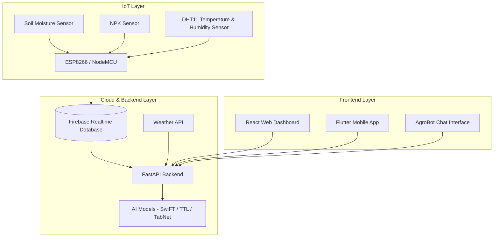
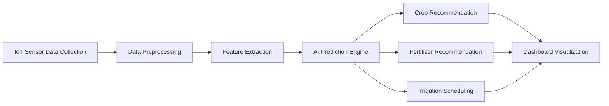

# 🌱 AI-Driven Smart Agriculture System

## AI-Driven Smart Agriculture: An Integrated Approach for Soil Analysis, Irrigation, and Crop-Fertilizer Recommendations

An intelligent smart farming platform that integrates **IoT sensors**, **Artificial Intelligence**, **Deep Learning**, and **Explainable AI (XAI)** to provide real-time monitoring, crop recommendation, fertilizer optimization, and irrigation scheduling.

The system is designed to help farmers make data-driven decisions while improving sustainability, reducing water wastage, and increasing agricultural productivity.

---

# 📌 Features

* 🌡️ Real-time soil and environmental monitoring
* 💧 Smart irrigation scheduling
* 🌾 AI-based crop recommendation
* 🧪 Fertilizer optimization using NPK analysis
* 📊 Explainable AI visualizations using SHAP
* ☁️ Firebase cloud integration
* 📱 Web dashboard and mobile application
* 🤖 AgroBot chatbot interface
* 🌦️ Weather API integration
* 📈 Data analytics and visualization

---

# 🏗️ System Architecture



---

# 🔄 System Workflow



---

# 📸 Screenshots

## Web Dashboard


## Mobile Application


## Crop Recommendation Interface


## Fertilizer Optimization


## Irrigation Scheduler


## SHAP Explainable AI Analysis


## Hardware Implementation


---

# ⚙️ Technologies Used

## Programming Languages

* Python
* JavaScript
* C++

## Frontend

* ReactJS
* Flutter

## Backend

* FastAPI
* Flask

## AI / ML Frameworks

* PyTorch
* TensorFlow
* Scikit-learn

## Cloud & Database

* Firebase Realtime Database
* SQLite

## Visualization

* Plotly
* Matplotlib
* Chart.js

---

# 🧠 AI Models Used

## 1. SwiFT (Transformer-Based Tabular Learning)

Used for:

* Crop recommendation
* Soil analysis
* Fertility prediction

### Advantages

* Handles heterogeneous sensor data
* High prediction accuracy
* Efficient tabular learning

---

## 2. TabNet

Used for:

* Interpretable crop recommendation
* Feature selection
* Explainable tabular prediction

### Advantages

* Built-in interpretability
* Efficient feature attention mechanism

---

## 3. TTL (Transformer-based Tabular Learning)

Used for:

* Smart irrigation scheduling
* Environmental pattern learning

### Advantages

* Learns contextual relationships
* Better sequence understanding

---

# 🔍 Explainable AI (XAI)

The system integrates:

* SHAP (SHapley Additive exPlanations)
* LIME (Local Interpretable Model-Agnostic Explanations)

This helps farmers understand:

* Why a crop was recommended
* Why irrigation is needed
* Which soil factors influenced predictions

---

# 📂 Project Structure

```text
smart-agriculture-system/
│
├── backend/
│   ├── models/
│   ├── routes/
│   ├── datasets/
│   └── main.py
│
├── frontend/
│
├── mobile_app/
│
├── hardware/
│
├── docs/
│   └── images/
│
└── README.md
```

---

# 🚀 Setup Instructions

# 1️⃣ Clone Repository

```bash
git clone https://github.com/yourusername/smart-agriculture-system.git
cd smart-agriculture-system
```

---

# 2️⃣ Backend Setup (FastAPI)

```bash
cd backend
```

## Create Virtual Environment

### Windows

```bash
python -m venv .venv
.venv\Scripts\activate
```

### Linux / Mac

```bash
python3 -m venv .venv
source .venv/bin/activate
```

## Install Dependencies

```bash
pip install -r requirements.txt
```

## Run Backend Server

```bash
uvicorn main:app --reload --host 0.0.0.0 --port 8000
```

Backend API:

```text
http://localhost:8000
```

Swagger Documentation:

```text
http://localhost:8000/docs
```

---

# 3️⃣ Frontend Setup (React)

```bash
cd frontend
npm install
npm run dev
```

Frontend:

```text
http://localhost:5173
```

---

# 4️⃣ Flutter Mobile App Setup

```bash
cd mobile_app
flutter pub get
flutter run
```

---

# 🔌 Hardware Components

| Component                 | Description                              |
| ------------------------- | ---------------------------------------- |
| ESP8266 / NodeMCU         | Main IoT microcontroller                 |
| Soil Moisture Sensor      | Measures soil water content              |
| NPK Sensor                | Measures Nitrogen, Phosphorus, Potassium |
| DHT11 / DHT22             | Temperature & Humidity sensor            |
| Firebase                  | Cloud database                           |
| Power Supply              | 5V–12V regulated supply                  |
| Breadboard & Jumper Wires | Hardware connections                     |

---

# 🔗 API Documentation

## Authentication APIs

### Register User

```http
POST /api/auth/register
```

### Login User

```http
POST /api/auth/login
```

---

## Prediction APIs

### Crop Recommendation

```http
POST /api/crop/predict
```

### Fertilizer Recommendation

```http
POST /api/fertilizer/predict
```

### Irrigation Prediction

```http
POST /api/irrigation/predict
```

---

## Weather API

### Get Current Weather

```http
GET /api/weather/current
```

---

## Sensor Data APIs

### Get Live Sensor Data

```http
GET /api/sensors/live
```

### Store Sensor Readings

```http
POST /api/sensors/upload
```

---

# 📊 Functional Modules

## 1. Data Acquisition Module

* Collects real-time sensor data
* Integrates weather APIs

## 2. Data Preprocessing Module

* Noise filtering
* Missing value handling
* Normalization

## 3. AI Prediction Engine

* Crop prediction
* Irrigation scheduling
* Fertilizer optimization

## 4. Visualization Layer

* Dashboard analytics
* SHAP visualizations
* Alerts & notifications

## 5. Cloud Integration

* Firebase synchronization
* Real-time updates

---

# 📈 Future Scope

* Satellite data integration
* Drone-based crop monitoring
* Edge AI deployment
* Multi-language farmer assistant
* Continuous model retraining
* Advanced disease detection

---

# 🎯 Objectives

* Improve farming efficiency
* Reduce water wastage
* Optimize fertilizer usage
* Provide explainable AI recommendations
* Enable sustainable agriculture

---

# 👨‍💻 Developed By

* Mohammed Roshan
* Afra KT
* Amna Hiba
* Fathimath Shahma O
* Mohammed Shybin CH

Department of Information Technology
MEA Engineering College
APJ Abdul Kalam Technological University

---

# 📜 License

This project is developed for academic and research purposes.

MIT License © 2026
